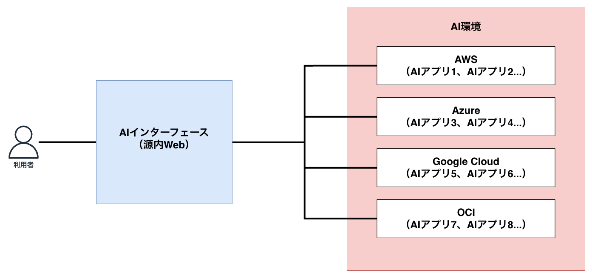

# 第2章 システムアーキテクチャの紹介

## この章の目的

「源内」全体の構成要素と、各要素の役割・連携を把握します。デプロイ作業の前に、どのリソースが何のために必要かを理解しておくと、後の章がスムーズに進みます。

### 全体概要図

{ width="100%" }

源内 Web は「AI インターフェース」として機能し、実際の生成AI処理を担う「AI アプリ」は別環境に置かれます。AI アプリはAWSだけでなく他のクラウドにも配置できる構成です。このハンズオンではAWS上のAIアプリを扱います。

### 源内 Web（AIインターフェース）概要図

{ width="100%" }

図中で破線で囲まれたリソース（WAF、Monitoring）はオプショナルです。各サービスの概要はAWS公式ドキュメントの定義に基づいています（確認日: 2026-07-19）。

| サービス | 概要 |
| --- | --- |
| AWS WAF | 保護対象へ転送されるHTTP／HTTPSリクエストを監視し、一般的なWebの脆弱性攻撃やボットなどからアプリケーションを保護するWebアプリケーションファイアウォール。CloudFrontディストリビューションに関連付けできる（図中ではオプショナル） |
| Amazon CloudFront | 静的・動的なWebコンテンツを、エッジロケーションと呼ばれる世界中のデータセンター経由で低レイテンシーに配信するサービス。図では画面配信とAPIアクセスの入口、ストリーミングレスポンスの経路になっている |
| Amazon S3（フロント側） | 任意の量のデータを保存・取得できるスケーラブルなオブジェクトストレージ。図では源内 Web の画面を構成する静的ファイルの配置先 |
| Amazon Cognito | Webアプリ・モバイルアプリ向けのIDプラットフォーム。ユーザーディレクトリ、認証サーバー、OAuth 2.0アクセストークンやAWS認証情報の認可を提供する（図中では2か所に配置） |
| Amazon API Gateway | REST、HTTP、WebSocketのAPIを作成、公開、保守、監視、セキュア化するサービス。図では画面からのRESTリクエストの入口 |
| AWS Lambda | サーバーのプロビジョニングや管理なしにコードを実行できるサーバーレスコンピューティング。図では用途ごとに複数の関数が並ぶ |
| Amazon S3（バックエンド側） | 同じくオブジェクトストレージ。図ではファイルやドキュメントなどのデータ保管先 |
| Amazon DynamoDB | サーバーレスかつフルマネージドの分散NoSQLデータベース。キーバリューとドキュメントのデータモデルを扱う |
| AWS Secrets Manager | データベース認証情報、アプリケーション認証情報、OAuthトークン、APIキーなどのシークレットを、ライフサイクル全体にわたり管理・取得・ローテーションするサービス |
| Amazon Transcribe | 機械学習モデルを使って音声をテキストへ変換する自動音声認識（ASR）サービス。ファイル単位のバッチとリアルタイムのストリーミングに対応する |
| Amazon Bedrock | Amazonおよび主要AI企業の基盤モデル（FM）をAPI経由で利用できるフルマネージドサービス |
| Amazon CloudWatch（Alarm） | 単一のメトリクスまたはメトリクス演算式を指定期間監視し、しきい値に対する状態変化に応じてSNS通知などのアクションを実行するアラーム（図中ではオプショナル） |
| Amazon SNS | パブリッシャーがトピックへ送信したメッセージを、複数のサブスクライバーへ配信するフルマネージドのpub/subメッセージングサービス（図中ではオプショナル） |
| Amazon Q Developer in chat applications（旧 AWS Chatbot） | SNSトピックの通知をSlack、Microsoft Teams、Amazon Chimeのチャットへ連携し、チーム内で運用イベントを共有できるサービス（図中の表記は ChatBot。オプショナル） |

## 参考リンク

- 源内 Web リポジトリ: <https://github.com/digital-go-jp/genai-web>
- 源内 AI アプリ リポジトリ: <https://github.com/digital-go-jp/genai-ai-api>

## 図の出典とライセンス

このページに掲載した「全体概要図」および「源内 Web（AIインターフェース）概要図」は、デジタル庁の公式リポジトリで公開されている図をそのまま引用したものです。

- 作品名: アーキテクチャ（全体概要図、源内 Web（AIインターフェース）概要図）
- 権利者: デジタル庁（Digital Agency of Japan）
- 出典: [digital-go-jp/genai-web ｜ docs/アーキテクチャ.md](https://github.com/digital-go-jp/genai-web/blob/main/docs/%E3%82%A2%E3%83%BC%E3%82%AD%E3%83%86%E3%82%AF%E3%83%81%E3%83%A3.md)
- ライセンス: [Creative Commons 表示 4.0 国際（CC BY 4.0）](https://creativecommons.org/licenses/by/4.0/deed.ja)
- 変更の有無: 変更を加えていません

同リポジトリでは、ソースコードはMIT License、ドキュメント（`*.md`）・画像・図はCC BY 4.0で提供されています。本資料は有志による非公式資料であり、デジタル庁による作成・承認・サポートを受けたものではありません。
