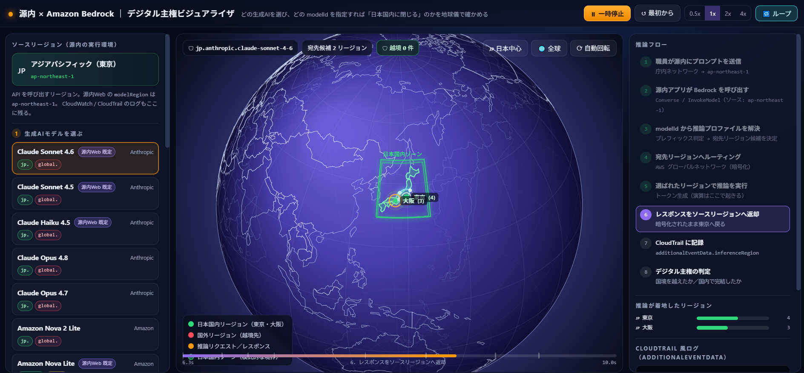

# 第5章 AWSアカウントの注意（コスト、権限、リージョン）

!!! warning "AWS利用時の共通の注意"
    ハンズオン後にリソースが残っていると、想定外の課金が発生する可能性があります。この章の内容を確認したうえで、[後片付け](cleanup.md) の章まで通して完了してください。

## コスト

AWS利用料として、約600円が発生する見込みです。

## 権限（IAM）

- AdministratorAccess権限を持つIAMユーザー

## リージョン

!!! tip "補助資料: デジタル主権ビジュアライザ"
    リージョン選定とAmazon Bedrockのクロスリージョン推論で、データがどの国・地域を経由するのかを地球儀上で確認できる補助資料です。

    [源内 × Amazon Bedrock デジタル主権ビジュアライザを開く](sovereignty-globe/index.html){ target="_blank" rel="noopener" }

    クロスリージョン推論の対応リージョンや挙動は変更される可能性があります。実際の構成判断では、必ずAWS公式ドキュメントで最新情報を確認してください。

    { width="100%" }
